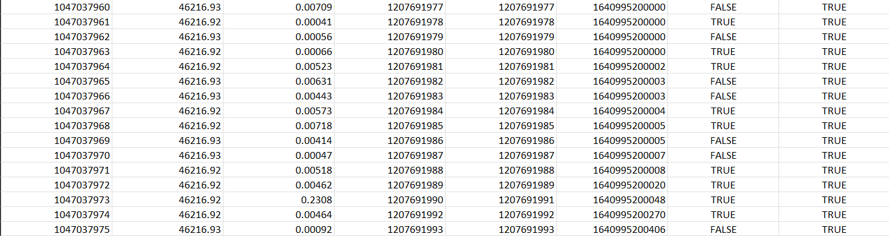
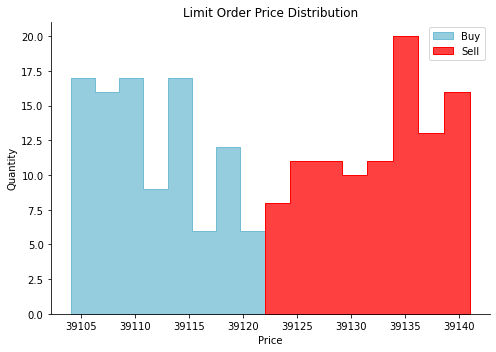

# quant-trading
This repository is a corpus of quantitative analysis of the crypto markets using the Binance API based on Stephan Jansen's [book](https://www.amazon.com/Machine-Learning-Algorithmic-Trading-alternative/dp/1839217715) -- *Machine Learning for Algorithmic Trading: Predictive models to extract signals from market and alternative data for systematic trading strategies with Python, 2nd Edition*.


### 1. Market Data
**Order book analysis**: After slightly modifying and refactoring the [Binance Public Data](https://github.com/binance/binance-public-data/) script, I was able to download the list of daily aggregate trades (buy and sell data) for any asset on the exchange for a specified period. I chose to analyze aggregate trades over normal trades. If you want to read about the difference, you can do so [here](https://www.reddit.com/r/BinanceExchange/comments/8sangq/api_what_is_the_difference_between_aggtrades_and/e102l7x/). I was also able to download the Futures orderbook data from Binance (API whitelisting needed).

An orderbook is categorized into the buy orders, sell orders, size and price. Analyzing these four attributes for a particular asset informs us about the order imbalances that give insight into an asset's direction over the short term. For example, a large number of buy orders around a specific level might indicate a level of support for the asset. 


The [MarketData](MarketData/) folder is divided into the [`data collection`](MarketData/data_collection/) segment where I download order book data and the [`data analysis`](MarketData/data_analysis/) segment where I compare the real-time order flows between the bid and ask prices of an asset i.e. BTCSUSD Futures. The `data_collection` folder contains the scripts to download (futures) order book and (spot) trade print data. 

The futures order book spreadsheet is categorized into:
- `symbol`
- `side (buy order or sell order)`
- `timestamp`
- `price`
- `quantity`

The spreadsheet for the spot and futures trades is categorized into:
- `Aggregate tradeId`
- `Price`
- `Quantity`
- `First tradeId`
- `Last tradeId`
- `Timestamp`
- `Was the buyer the maker`
- `Was the trade the best price match`.

    

The Binance Individual and Aggregrate Trades can be downloaded [here](https://data.binance.vision/).

```bash
# Get realtime Order Book API endpoint
curl -X GET https://fapi.binance.com/fapi/v1/depth?symbol=BTCUSDT
```

